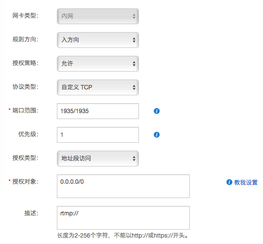
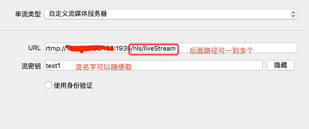
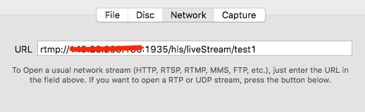
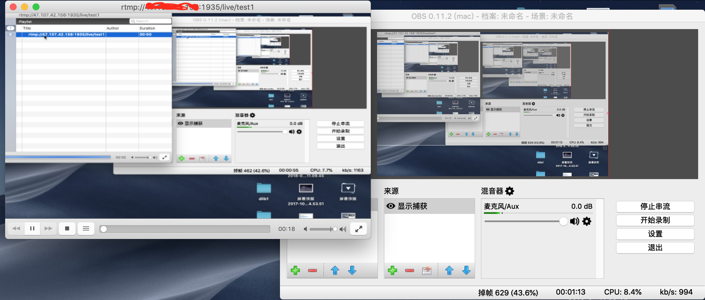

title: SRS服务器一 搭建
author: Cyrus
tags:
  - SRS
categories:
  - rtmp
date: 2018-10-23 23:33:00
---
### 一、什么是srs服务器

按照项目github上的说法：SRS定位是运营级的互联网直播服务器集群，追求更好的概念完整性和最简单实现的代码。也就是说srs服务器是一个功能强大，容易实现的直播服务器。

除了srs，直播服务器还有下面这些选择：

FMS — Adobe公司出品的服务器，价格昂贵，当然是最正宗的，因为RTMP就是Adobe公司的私有协议；

Wowza — 需要授权费，效率和稳定性都还不错；

Red5 — 一个开源实现， 效率和稳定性都稍微差些，由于它是Java实现的，所以天生支持跨平台运行；

Nignx-rtmp-module – -nginx的一个第三方模块，如果你熟悉nginx那是不错的选择，当然它也是免费的，不过功能就没有其他几个丰富了

### 二、srs服务器的搭建（Ubuntu或Centos）

#### 1、下载
```
git clone https://github.com/ossrs/srs
```
#### 2、编译
```
cd srs/trunk
./configure && make
```
服务器配置相对好点的，可以尝试 make -jn(n为线程数)加快编辑速度

#### 3、编辑conf/rtmp.conf文件，配置内容：
```
listen              1935;
pid                 ./objs/srs.pid;
chunk_size          60000;
ff_log_dir          ./objs;
srs_log_tank        file;  
#配置日志答应到文件，需要和srs_log_level配合使用
srs_log_level       trace;
#制定配置文件的级别，默认级别是trace
srs_log_file        ./objs/srs.log;  
#制定日志文件的位置。
max_connections     1000;
#最大连接数
daemon              on;
#以daemon的方式启动，如果要启动在console，那么需要配置daemon off;并且，需要配置srs_log_tank console;
utc_time            off;
#是否使用utc时间。如果该值为off则使用本地时间，如果开始使用utc时间。
vhost __defaultVhost__ {   
#默认的vhost，在没有指明vhost的情况，默认使用这个vhost。
}
```

#### 4、启动服务
在trunk目录下
```
 ./objs/srs -c conf/srs.conf
```
*其他操作相关指令
```
停止 ./etc/init.d/srs stop
重启 ./etc/init.d/srs restart
```

#### 5、其他注意事项
*如果是阿里云服务器，需要设置端口映射。
安全规则->添加安全规则


### 三、rtmp推流与播放

#### 1、使用obs推流
obs是一款免费且开源的用于视频录制以及直播串流的软件。在Windows, Mac以及Linux下均有客户端。obs设置如下:


#### 2、使用vlc播放
VLC 是一款自由、开源的跨平台多媒体播放器及框架，可播放大多数多媒体文件，以及 DVD、音频 CD、VCD 及各类流媒体协议。vcl播放链接是obs的URL/流密钥，如下图：


#### 3、最终效果如下图
